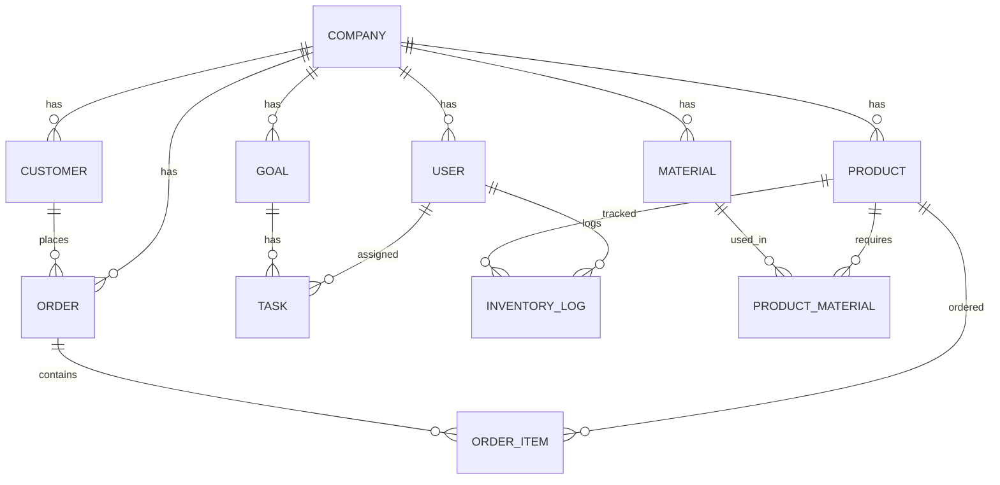
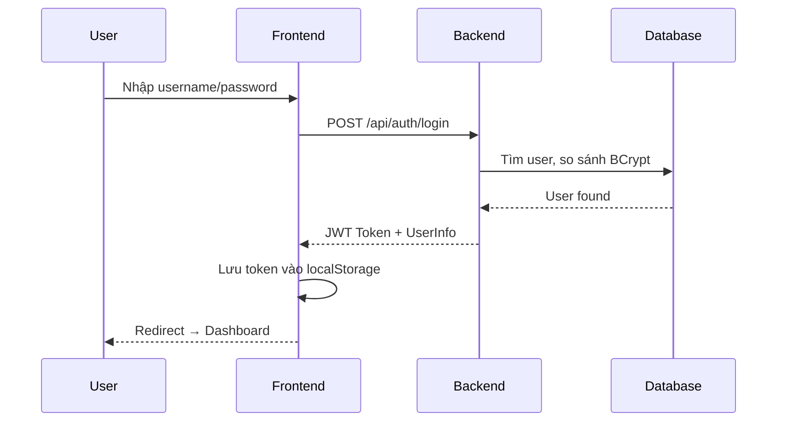
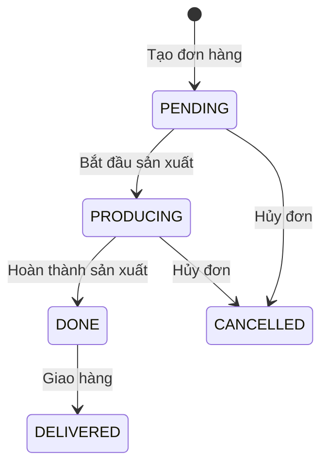

# BÁO CÁO DỰ ÁN ORCA
### Hệ thống Quản lý Sản xuất & Kho vận cho Xưởng sản xuất

---

## 1. ĐẶT VẤN ĐỀ

### 1.1 Thực trạng ngành sản xuất vừa và nhỏ tại Việt Nam

Theo thống kê, hơn **98% doanh nghiệp Việt Nam** thuộc quy mô vừa và nhỏ (SME), trong đó các xưởng sản xuất thủ công, may mặc, nội thất, thực phẩm... chiếm tỷ trọng lớn. Tuy nhiên, phần lớn các xưởng này vẫn đang quản lý bằng **phương pháp thủ công**, dẫn đến nhiều vấn đề nghiêm trọng:

### 1.2 Các vấn đề cần giải quyết

| # | Vấn đề | Hậu quả |
|---|--------|---------|
| 1 | **Quản lý kho bằng sổ tay / Excel** | Không nắm được tồn kho thời gian thực, thường xuyên hết nguyên liệu giữa chừng hoặc tồn kho quá nhiều gây lãng phí vốn |
| 2 | **Không có công thức nguyên liệu (BOM) chuẩn** | Mỗi lần sản xuất phải nhớ hoặc hỏi lại, dẫn đến sai lệch chất lượng sản phẩm, tính toán chi phí không chính xác |
| 3 | **Đơn hàng thiếu theo dõi trạng thái** | Không biết đơn nào đang sản xuất, đơn nào đã giao, đơn nào trễ hạn → mất uy tín với khách hàng |
| 4 | **Thông tin khách hàng phân tán** | Lưu trong tin nhắn, Zalo, Excel riêng lẻ → khó chăm sóc lại, dễ mất thông tin khi nhân sự nghỉ việc |
| 5 | **Phân công công việc bằng miệng** | Nhân viên không rõ việc cần làm, deadline, trách nhiệm → chậm tiến độ, đùn đẩy |
| 6 | **Thiếu phân quyền rõ ràng** | Nhân viên có thể tùy ý chỉnh sửa/xóa dữ liệu quan trọng (sản phẩm, đơn hàng, giá) → rủi ro dữ liệu |
| 7 | **Không có báo cáo tổng hợp** | Chủ xưởng không nắm được bức tranh tổng thể: bao nhiêu đơn, bao nhiêu sản phẩm, nguyên liệu nào sắp hết → ra quyết định chậm, thiếu căn cứ |
| 8 | **Mỗi xưởng một cách quản lý** | Không có quy trình chuẩn hóa → khó mở rộng quy mô, khó đào tạo nhân viên mới |

### 1.3 Giải pháp đề xuất — Hệ thống ORCA

**ORCA** ra đời nhằm giải quyết đồng bộ tất cả các vấn đề trên thông qua một nền tảng duy nhất:

| Vấn đề | Giải pháp ORCA |
|--------|----------------|
| Quản lý kho thủ công | ✅ Quản lý kho số hóa, cảnh báo tồn kho thấp tự động |
| Không có BOM | ✅ Công thức nguyên liệu cho từng sản phẩm, tính toán chính xác |
| Đơn hàng không theo dõi | ✅ Quản lý đơn hàng đa trạng thái (Chờ → SX → Hoàn thành → Giao) |
| Thông tin phân tán | ✅ CRM tích hợp: khách hàng, đơn hàng, lịch sử trong một hệ thống |
| Phân công bằng miệng | ✅ Hệ thống Goal → Task, phân công và theo dõi tiến độ |
| Thiếu phân quyền | ✅ RBAC: MANAGER (toàn quyền) vs MEMBER (chỉ xem + thao tác cơ bản) |
| Không có báo cáo | ✅ Dashboard tổng hợp thời gian thực |
| Thiếu quy trình | ✅ Quy trình chuẩn hóa, sẵn sàng mở rộng |

### 1.4 Đối tượng sử dụng

- **Chủ xưởng / Quản lý** (MANAGER): Quản lý toàn bộ hoạt động xưởng, ra quyết định dựa trên dữ liệu
- **Nhân viên** (MEMBER): Xem thông tin sản xuất, cập nhật trạng thái công việc, ghi nhật ký kho

---

## 2. TỔNG QUAN DỰ ÁN

### 2.1 Giới thiệu
**ORCA** là hệ thống quản lý tổng thể dành cho các xưởng sản xuất vừa và nhỏ, hỗ trợ quản lý toàn diện từ kho nguyên liệu, sản phẩm, đơn hàng, khách hàng, đến mục tiêu và phân công công việc. Hệ thống được xây dựng theo kiến trúc **Client-Server** với backend API RESTful và frontend SPA (Single Page Application).

### 2.2 Mục tiêu
- Quản lý kho sản phẩm và nguyên liệu với cảnh báo tồn kho thấp
- Quản lý đơn hàng với theo dõi trạng thái đa bước
- Quản lý công thức nguyên liệu (BOM) cho từng sản phẩm
- Quản lý khách hàng và công ty
- Phân công mục tiêu, task cho nhân viên
- Phân quyền RBAC (Role-Based Access Control) cho MANAGER và MEMBER
- Hỗ trợ đăng nhập bằng tài khoản hoặc Google OAuth2

---

## 3. KIẾN TRÚC HỆ THỐNG

### 3.1 Kiến trúc tổng thể

```
┌─────────────────────┐       ┌─────────────────────────────┐       ┌──────────────┐
│   Frontend (Web)    │──────▶│     Backend (Spring Boot)   │──────▶│  SQL Server  │
│   React + Vite      │ HTTP  │     REST API + Security     │  JPA  │   orca_db    │
│   localhost:5173     │◁─────│     localhost:8080           │◁─────│              │
└─────────────────────┘       └──────────┬──────────────────┘       └──────────────┘
                                         │
                                         ▼
                              ┌──────────────────────┐
                              │   Google OAuth2 API   │
                              └──────────────────────┘
```

### 3.2 Mô hình phân lớp Backend

```
Controller Layer     ──▶  Nhận HTTP Request, xác thực, gọi Service
     │
Service Layer        ──▶  Xử lý nghiệp vụ, mapping Entity ↔ DTO
     │
Repository Layer     ──▶  Truy vấn Database (Spring Data JPA)
     │
Entity Layer         ──▶  Ánh xạ bảng Database (Hibernate ORM)
```

---

## 4. CÔNG NGHỆ SỬ DỤNG

### 4.1 Backend

| Công nghệ | Phiên bản | Vai trò |
|------------|-----------|---------|
| Java | 24 | Ngôn ngữ lập trình chính |
| Spring Boot | 3.4.1 | Framework backend |
| Spring Data JPA | 3.4.x | ORM, truy vấn database |
| Spring Security | 6.x | Xác thực & phân quyền |
| JWT (jjwt) | 0.12.6 | Token xác thực |
| OAuth2 Client | Spring Boot | Đăng nhập Google |
| SQL Server | — | Cơ sở dữ liệu |
| Lombok | 1.18.38 | Giảm boilerplate code |
| Maven | — | Build tool |

### 4.2 Frontend

| Công nghệ | Phiên bản | Vai trò |
|------------|-----------|---------|
| React | 19.2.0 | UI framework |
| TypeScript | 5.9.3 | Ngôn ngữ type-safe |
| Vite | 7.2.4 | Build tool & dev server |
| React Router | 7.13.0 | Routing SPA |
| Axios | 1.13.2 | HTTP client |
| ESLint | 9.39 | Kiểm tra lỗi code |

---

## 5. CƠ SỞ DỮ LIỆU

### 5.1 Sơ đồ Entity Relationship (ERD)



### 5.2 Danh sách Entity (13 bảng)

| Entity | Mô tả | Trường chính |
|--------|--------|-------------|
| `Company` | Công ty/xưởng sản xuất | id, name, taxCode, subscriptionPlan |
| `User` | Người dùng hệ thống | id, username, password, role (MANAGER/MEMBER), company |
| `Product` | Sản phẩm | id, name, sku, category, stockQuantity, location, company |
| `Material` | Nguyên liệu | id, name, sku, unit, stockQuantity, minStock, location, company |
| `ProductMaterial` | Công thức NL (BOM) | id, product, material, quantityNeeded |
| `Customer` | Khách hàng | id, name, phone, email, address, company |
| `Order` | Đơn hàng | id, orderCode, status, totalAmount, deadline, customer, company |
| `OrderItem` | Chi tiết đơn hàng | id, order, product, quantity, unitPrice |
| `OrderStatus` | Enum trạng thái ĐH | PENDING, PRODUCING, DONE, DELIVERED, CANCELLED |
| `InventoryLog` | Lịch sử xuất/nhập kho | id, product, user, changeQuantity, reason |
| `Goal` | Mục tiêu công việc | id, title, description, status, company |
| `Task` | Task phân công | id, title, status, assignee, goal, deadline |
| `Role` | Enum vai trò | MANAGER, MEMBER |

---

## 6. API ENDPOINTS

### 6.1 Authentication (Xác thực)

| Method | Endpoint | Mô tả | Quyền |
|--------|----------|-------|-------|
| POST | `/api/auth/register` | Đăng ký tài khoản | Public |
| POST | `/api/auth/login` | Đăng nhập (JWT) | Public |
| GET | `/api/auth/me` | Thông tin user hiện tại | Authenticated |
| GET | `/oauth2/authorization/google` | Đăng nhập Google | Public |

### 6.2 Product (Sản phẩm)

| Method | Endpoint | Mô tả | Quyền |
|--------|----------|-------|-------|
| GET | `/api/products` | Danh sách sản phẩm | Authenticated |
| GET | `/api/products/{id}` | Chi tiết sản phẩm | Authenticated |
| POST | `/api/products` | Tạo sản phẩm | MANAGER |
| PUT | `/api/products/{id}` | Cập nhật sản phẩm | MANAGER |
| DELETE | `/api/products/{id}` | Xóa sản phẩm | MANAGER |

### 6.3 Product Material — BOM (Công thức nguyên liệu)

| Method | Endpoint | Mô tả | Quyền |
|--------|----------|-------|-------|
| GET | `/api/products/{productId}/materials` | BOM của sản phẩm | Authenticated |
| POST | `/api/products/{productId}/materials` | Thêm NL vào BOM | MANAGER |
| PUT | `/api/product-materials/{id}` | Sửa số lượng NL | MANAGER |
| DELETE | `/api/product-materials/{id}` | Xóa NL khỏi BOM | MANAGER |

### 6.4 Material (Nguyên liệu)

| Method | Endpoint | Mô tả | Quyền |
|--------|----------|-------|-------|
| GET | `/api/materials` | Danh sách nguyên liệu | Authenticated |
| GET | `/api/materials/{id}` | Chi tiết nguyên liệu | Authenticated |
| POST | `/api/materials` | Tạo nguyên liệu | MANAGER |
| PUT | `/api/materials/{id}` | Cập nhật nguyên liệu | MANAGER |
| DELETE | `/api/materials/{id}` | Xóa nguyên liệu | MANAGER |

### 6.5 Customer (Khách hàng)

| Method | Endpoint | Mô tả | Quyền |
|--------|----------|-------|-------|
| GET | `/api/customers` | Danh sách khách hàng | Authenticated |
| POST | `/api/customers` | Tạo khách hàng | Authenticated |
| PUT | `/api/customers/{id}` | Cập nhật khách hàng | Authenticated |
| DELETE | `/api/customers/{id}` | Xóa khách hàng | Authenticated |

### 6.6 Order (Đơn hàng)

| Method | Endpoint | Mô tả | Quyền |
|--------|----------|-------|-------|
| GET | `/api/orders` | Danh sách đơn hàng | Authenticated |
| GET | `/api/orders/{id}` | Chi tiết đơn hàng | Authenticated |
| POST | `/api/orders` | Tạo đơn hàng | Authenticated |
| PATCH | `/api/orders/{id}/status` | Cập nhật trạng thái | Authenticated |
| DELETE | `/api/orders/{id}` | Xóa đơn hàng | MANAGER |

### 6.7 Goal & Task (Mục tiêu & Công việc)

| Method | Endpoint | Mô tả | Quyền |
|--------|----------|-------|-------|
| GET | `/api/goals` | Danh sách mục tiêu | Authenticated |
| POST | `/api/goals` | Tạo mục tiêu | MANAGER |
| PATCH | `/api/goals/{id}/status` | Cập nhật trạng thái | Authenticated |
| DELETE | `/api/goals/{id}` | Xóa mục tiêu | MANAGER |
| GET | `/api/tasks` | Danh sách task | Authenticated |
| POST | `/api/tasks` | Tạo task | Authenticated |
| PATCH | `/api/tasks/{id}/status` | Cập nhật trạng thái | Authenticated |
| PATCH | `/api/tasks/{id}/assign` | Phân công nhân viên | Authenticated |
| DELETE | `/api/tasks/{id}` | Xóa task | Authenticated |

### 6.8 Company (Công ty)

| Method | Endpoint | Mô tả | Quyền |
|--------|----------|-------|-------|
| GET | `/api/companies` | Danh sách công ty | Authenticated |
| GET | `/api/companies/{id}` | Chi tiết công ty | Authenticated |
| POST | `/api/companies` | Tạo công ty | MANAGER |
| PUT | `/api/companies/{id}` | Cập nhật công ty | MANAGER |
| DELETE | `/api/companies/{id}` | Xóa công ty | MANAGER |

### 6.9 Khác

| Method | Endpoint | Mô tả | Quyền |
|--------|----------|-------|-------|
| GET | `/api/reports/summary` | Dashboard tổng hợp | Authenticated |
| POST | `/api/inventory-logs` | Ghi nhật ký kho | Authenticated |
| GET | `/api/inventory-logs` | Lịch sử xuất/nhập | Authenticated |

---

## 7. BẢO MẬT & PHÂN QUYỀN

### 7.1 Xác thực (Authentication)

```
Người dùng ──▶ POST /api/auth/login ──▶ Server xác thực ──▶ Trả JWT Token
                                                                    │
Người dùng ──▶ Gửi request kèm Header ◁─────────────────────────────┘
               Authorization: Bearer <token>
```

- **JWT Token**: Có hiệu lực 24 giờ (86.400.000ms)
- **Mã hóa mật khẩu**: BCrypt
- **OAuth2**: Đăng nhập Google, tự động tạo tài khoản nếu chưa có

### 7.2 Phân quyền (Authorization — RBAC)

| Vai trò | Quyền |
|---------|-------|
| **MANAGER** | Toàn quyền: tạo, sửa, xóa sản phẩm, nguyên liệu, đơn hàng, mục tiêu, công ty, BOM |
| **MEMBER** | Chỉ xem dữ liệu, tạo task, ghi nhật ký kho, cập nhật trạng thái đơn hàng |

**Cơ chế thực thi:**
- **Backend**: Sử dụng `@PreAuthorize("hasRole('MANAGER')")` trên các endpoint nhạy cảm
- **Frontend**: Ẩn nút thao tác (Thêm, Sửa, Xóa) khi user có role MEMBER
- **Config**: `@EnableMethodSecurity` trong `SecurityConfig.java`

---

## 8. GIAO DIỆN NGƯỜI DÙNG (FRONTEND)

### 8.1 Cấu trúc trang

| Trang | File | Chức năng |
|-------|------|-----------|
| 🔐 Đăng nhập | `LoginPage.tsx` | Đăng nhập JWT + Google OAuth2 |
| 📝 Đăng ký | `RegisterPage.tsx` | Tạo tài khoản mới |
| 📊 Dashboard | `DashboardPage.tsx` | Tổng quan: thống kê SP, NL, KH, ĐH + cảnh báo |
| 📦 Sản phẩm | `ProductsPage.tsx` | CRUD sản phẩm + modal BOM (công thức NL) |
| 🧵 Nguyên liệu | `MaterialsPage.tsx` | CRUD nguyên liệu + tìm kiếm + lọc sắp hết |
| 📋 Đơn hàng | `OrdersPage.tsx` | CRUD đơn hàng + lọc theo trạng thái + chi tiết |
| 👥 Khách hàng | `CustomersPage.tsx` | CRUD khách hàng |
| 🎯 Mục tiêu & Task | `GoalsTasksPage.tsx` | Quản lý mục tiêu + phân công task |
| 📝 Nhật ký kho | `InventoryLogsPage.tsx` | Lịch sử xuất/nhập kho |
| 👤 Hồ sơ | `ProfilePage.tsx` | Thông tin cá nhân |
| ⚙️ Cài đặt | `SettingsPage.tsx` | Quản lý công ty (MANAGER only) |

### 8.2 Component dùng chung

| Component | Chức năng |
|-----------|-----------|
| `Sidebar.tsx` | Thanh điều hướng bên trái, phân nhóm menu theo chức năng |
| `Layout.tsx` | Layout chung (Sidebar + main content) |
| `ProtectedRoute.tsx` | Bảo vệ route, redirect về login nếu chưa xác thực |

### 8.3 Service Layer (Frontend)

| File | Chức năng |
|------|-----------|
| `api.ts` | Axios instance + JWT interceptor + 401 handler |
| `inventoryService.ts` | API: Products, ProductMaterials (BOM), InventoryLogs, Goals, Tasks |
| `workshopService.ts` | API: Customers, Orders, Materials, Reports, Companies |
| `AuthContext.tsx` | React Context quản lý auth state (login, register, logout, verify token) |

---

## 9. CẤU TRÚC DỰ ÁN

```
orca/
├── backend/                          # Spring Boot Backend
│   ├── src/main/java/org/example/backend/
│   │   ├── BackendApplication.java   # Main entry point
│   │   ├── controller/               # 12 REST Controllers
│   │   │   ├── AuthController.java
│   │   │   ├── CompanyController.java
│   │   │   ├── CustomerController.java
│   │   │   ├── GoalController.java
│   │   │   ├── InventoryLogController.java
│   │   │   ├── MaterialController.java
│   │   │   ├── OrderController.java
│   │   │   ├── ProductController.java
│   │   │   ├── ProductMaterialController.java
│   │   │   ├── ReportController.java
│   │   │   ├── TaskController.java
│   │   │   └── DebugController.java
│   │   ├── dto/                      # 13 Data Transfer Objects
│   │   ├── entity/                   # 13 JPA Entities
│   │   ├── repository/               # 11 JPA Repositories
│   │   ├── service/                  # 10 Business Services
│   │   ├── security/                 # 5 Security files
│   │   │   ├── SecurityConfig.java
│   │   │   ├── JwtUtil.java
│   │   │   ├── JwtAuthenticationFilter.java
│   │   │   ├── CustomUserDetailsService.java
│   │   │   └── OAuth2LoginSuccessHandler.java
│   │   ├── DataSeeder.java           # Seeder dữ liệu mẫu
│   │   ├── ProductSeeder.java
│   │   ├── MaterialSeeder.java
│   │   └── CustomerOrderSeeder.java
│   ├── src/main/resources/
│   │   └── application.properties    # Cấu hình DB, JWT, OAuth2
│   └── pom.xml                       # Maven dependencies
│
├── frontend-web/                     # React + TypeScript Frontend
│   ├── src/
│   │   ├── pages/                    # 12 trang giao diện
│   │   ├── components/               # 3 component dùng chung
│   │   ├── services/                 # 4 file API service
│   │   ├── context/                  # AuthContext
│   │   ├── types/                    # TypeScript interfaces
│   │   ├── App.tsx                   # Router chính
│   │   ├── App.css                   # Stylesheet chính
│   │   └── main.tsx                  # Entry point
│   ├── package.json
│   └── vite.config.ts
│
├── frontend-mobile/                  # (Dự kiến) Mobile app
└── database/                         # Script DB
```

---

## 10. LUỒNG HOẠT ĐỘNG CHÍNH (WORKFLOWS)

### 10.1 Đăng ký & Đăng nhập



### 10.2 Quản lý Đơn hàng



### 10.3 Quản lý BOM (Công thức nguyên liệu)

```
MANAGER chọn sản phẩm → Mở modal BOM → Xem danh sách nguyên liệu
                                       → Thêm nguyên liệu (chọn NL + số lượng cần)
                                       → Xóa nguyên liệu khỏi công thức
```

---

## 11. DATA SEEDING (Dữ liệu mẫu)

Hệ thống tự động tạo dữ liệu mẫu khi khởi động lần đầu:

| Seeder | Dữ liệu |
|--------|---------|
| `DataSeeder` | 2 công ty (FashionStudio, HandCraft), 2 user (admin/MANAGER, member/MEMBER) |
| `ProductSeeder` | ~10 sản phẩm mẫu cho mỗi công ty |
| `MaterialSeeder` | ~10 nguyên liệu mẫu cho mỗi công ty |
| `CustomerOrderSeeder` | Khách hàng + đơn hàng mẫu |

**Tài khoản mặc định:**
| Username | Password | Role | Công ty |
|----------|----------|------|---------|
| `admin` | `admin123` | MANAGER | FashionStudio |
| `member` | `member123` | MEMBER | FashionStudio |

---

## 12. HƯỚNG DẪN CÀI ĐẶT & CHẠY

### 12.1 Yêu cầu hệ thống
- JDK 24+
- Node.js 18+
- SQL Server (database: `orca_db`)

### 12.2 Chạy Backend
```bash
cd backend
# Cấu hình database trong application.properties
./mvnw spring-boot:run
# Backend chạy tại: http://localhost:8080
```

### 12.3 Chạy Frontend
```bash
cd frontend-web
npm install
npm run dev
# Frontend chạy tại: http://localhost:5173
```

---

## 13. THỐNG KÊ DỰ ÁN

| Hạng mục | Số lượng |
|----------|---------|
| Entity | 13 |
| Controller | 12 |
| Service | 10 |
| Repository | 11 |
| DTO | 13 |
| Frontend Pages | 12 |
| Frontend Components | 3 |
| API Service Files | 4 |
| API Endpoints | ~40+ |
| Data Seeders | 4 |
| Security Files | 5 |

---

## 14. KẾT LUẬN

Dự án ORCA đã triển khai đầy đủ các chức năng cốt lõi cho một hệ thống quản lý xưởng sản xuất:

✅ **Hoàn thành:**
- Xác thực JWT + OAuth2 Google
- CRUD đầy đủ cho: Sản phẩm, Nguyên liệu, Khách hàng, Đơn hàng, Mục tiêu, Task, Công ty
- Quản lý BOM (công thức nguyên liệu)
- Dashboard tổng hợp với cảnh báo tồn kho
- Phân quyền RBAC (MANAGER/MEMBER)  
- Nhật ký xuất/nhập kho
- Giao diện responsive, dark mode
- Dữ liệu mẫu tự động

📋 **Có thể mở rộng:**
- Tích hợp AI (đã có nền tảng từ conversation trước)
- Frontend mobile (đã có folder `frontend-mobile`)
- Báo cáo nâng cao (biểu đồ, xuất Excel)
- Notification/thông báo real-time
- Quản lý quy trình sản xuất chi tiết

---

*Báo cáo được tạo: 23/02/2026*  
*Dự án: ORCA — Hệ thống Quản lý Sản xuất & Kho vận*
